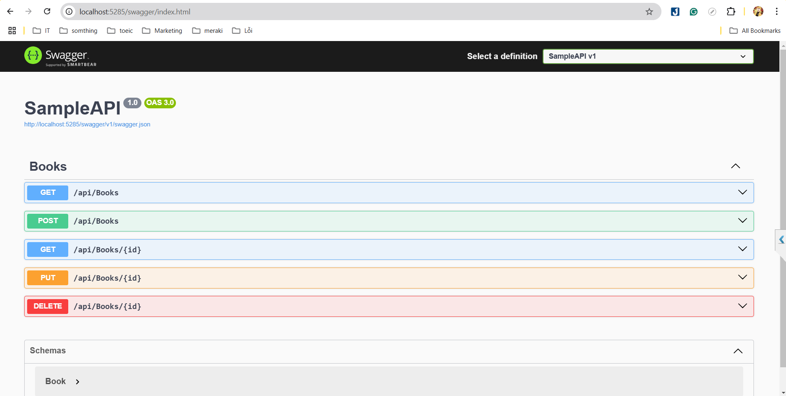
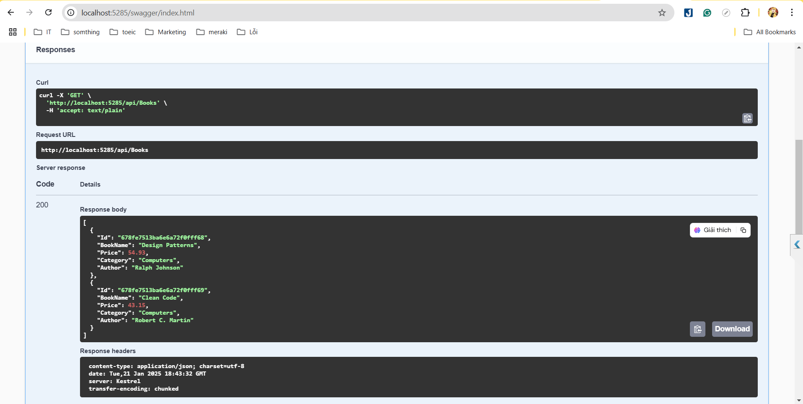

# Tài Liệu API Cửa Hàng Sách

## Tổng Quan Dự Án
Dự án này cung cấp một API RESTful để quản lý cửa hàng sách, được xây dựng bằng ASP.NET Core và kết nối với cơ sở dữ liệu MongoDB. API này hỗ trợ các thao tác CRUD (Tạo, Đọc, Cập Nhật, Xóa) đối với các cuốn sách, giúp quản lý dễ dàng bộ sưu tập sách trong cửa hàng.

### Công Nghệ Sử Dụng
- **ASP.NET Core**: Một framework hiện đại để xây dựng các ứng dụng web và API.
- **MongoDB**: Cơ sở dữ liệu NoSQL dùng để lưu trữ thông tin về các cuốn sách.
- **Swagger**: Công cụ tự động tạo tài liệu API và thử nghiệm API ngay trong trình duyệt.

## Cài Đặt và Cấu Hình
### Cấu Hình Dự Án
1. **Program.cs**: Cấu hình các dịch vụ và middleware cần thiết cho ứng dụng.
2. **Cấu Hình MongoDB**: Chuỗi kết nối MongoDB được định nghĩa trong tệp `appsettings.json` dưới `BookStoreDatabaseSettings`.
3. **Tích Hợp Swagger**: Swagger được tích hợp trong dự án, giúp dễ dàng kiểm tra các endpoint API trong môi trường phát triển.

### Cấu Hình MongoDB
MongoDB được sử dụng làm giải pháp cơ sở dữ liệu. Các cấu hình kết nối như tên cơ sở dữ liệu và tên bộ sưu tập sách được định nghĩa trong tệp `appsettings.json`. Các cấu hình này được truy cập thông qua lớp `BookStoreDatabaseSettings`.
```json
{
    "BookStoreDatabase": {
    "ConnectionString": "mongodb://localhost:27017",
    "DatabaseName": "BookStore",
    "BooksCollectionName": "Books"
  }
}
```
## Lớp `BooksService`

Lớp `BooksService` cung cấp các phương thức để tương tác với cơ sở dữ liệu MongoDB liên quan đến các cuốn sách trong cửa hàng sách. Lớp này sử dụng MongoDB.Driver để kết nối và thao tác với cơ sở dữ liệu, và Microsoft.Extensions.Options để lấy các cấu hình từ `appsettings.json`.

### Các Thành Phần Chính:
1. **MongoClient**: Sử dụng để kết nối với MongoDB qua chuỗi kết nối được cung cấp trong cấu hình.
2. **IMongoCollection<Book>**: Đại diện cho bộ sưu tập (collection) các cuốn sách trong cơ sở dữ liệu MongoDB.
3. **IOptions<BookStoreDatabaseSettings>**: Dùng để truy xuất cấu hình của cơ sở dữ liệu từ `appsettings.json` (bao gồm chuỗi kết nối, tên cơ sở dữ liệu và tên bộ sưu tập sách).

### Các Phương Thức:

| Phương Thức                     | Mô Tả                                                  | Kết Quả                                                   |
|----------------------------------|--------------------------------------------------------|----------------------------------------------------------|
| **Constructor**                  | Khởi tạo đối tượng `BooksService`, thiết lập kết nối với MongoDB sử dụng các cấu hình từ `appsettings.json` | Khởi tạo đối tượng với kết nối MongoDB.                   |
| **GetAsync()**                   | Lấy tất cả các cuốn sách trong cơ sở dữ liệu MongoDB.  | Trả về danh sách tất cả các cuốn sách.                   |
| **GetAsync(string id)**          | Lấy thông tin một cuốn sách theo `id`.                 | Trả về đối tượng `Book` nếu tìm thấy, hoặc `null` nếu không tìm thấy sách. |
| **CreateAsync(Book newBook)**    | Thêm một cuốn sách mới vào cơ sở dữ liệu MongoDB.      | Thực hiện thao tác không đồng bộ để thêm sách vào cơ sở dữ liệu. |
| **UpdateAsync(string id, Book updatedBook)** | Cập nhật thông tin cuốn sách theo `id`.               | Thực hiện thao tác không đồng bộ để cập nhật sách trong cơ sở dữ liệu. |
| **RemoveAsync(string id)**       | Xóa cuốn sách theo `id`.                               | Thực hiện thao tác không đồng bộ để xóa sách khỏi cơ sở dữ liệu. |

## Các Endpoint API

| Phương Thức HTTP | Endpoint                      | Mô Tả                                         | Kết Quả                              |
|------------------|-------------------------------|-----------------------------------------------|--------------------------------------|
| GET              | `/api/books`                  | Lấy danh sách tất cả các cuốn sách.           | Danh sách các cuốn sách.            |
| GET              | `/api/books/{id}`             | Lấy thông tin chi tiết của cuốn sách theo ID. | Trả về sách nếu tìm thấy, 404 nếu không tìm thấy. |
| POST             | `/api/books`                  | Thêm một cuốn sách mới vào cơ sở dữ liệu.     | Trả về mã 201 (Created) khi thêm thành công. |
| PUT              | `/api/books/{id}`             | Cập nhật thông tin sách nếu tồn tại.          | Trả về mã 200 (OK) nếu cập nhật thành công, hoặc 404 nếu không tìm thấy sách. |
| DELETE           | `/api/books/{id}`             | Xóa một cuốn sách khỏi cơ sở dữ liệu.         | Trả về mã 200 (OK) nếu xóa thành công, hoặc 404 nếu không tìm thấy sách. |



## Tính Năng
- **Kiểm Tra API Với Swagger**: Dự án tích hợp Swagger UI cho phép người dùng kiểm tra và thử nghiệm API trực tiếp từ trình duyệt. Tính năng này giúp việc kiểm tra và phát triển dễ dàng hơn.
- **Hoạt Động CRUD Linh Hoạt**: API hỗ trợ đầy đủ các thao tác CRUD để quản lý sách: tạo mới, đọc, cập nhật và xóa dữ liệu.
- **Tích Hợp Cơ Sở Dữ Liệu Dễ Dàng Mở Rộng**: MongoDB là giải pháp lý tưởng cho việc lưu trữ và mở rộng cơ sở dữ liệu, giúp ứng dụng có thể dễ dàng mở rộng khi số lượng sách gia tăng.

## Ví Dụ Dữ Liệu


```json
{
    "Name": "Design Patterns",
    "Price": 54.93,
    "Category": "Computers",
    "Author": "Ralph Johnson"
}

